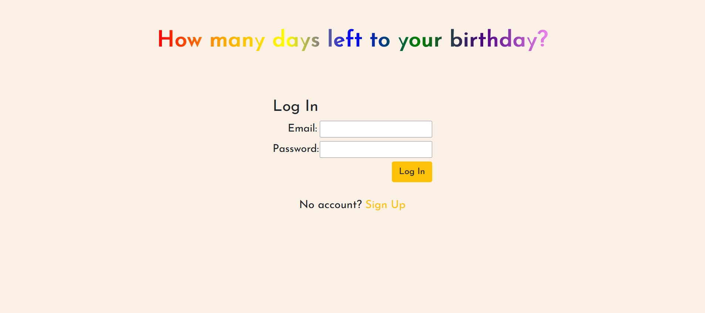
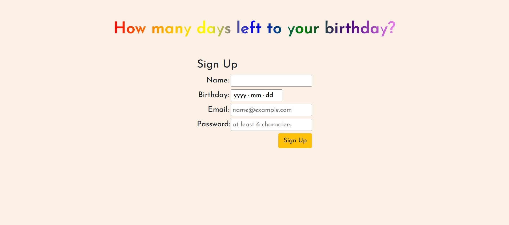
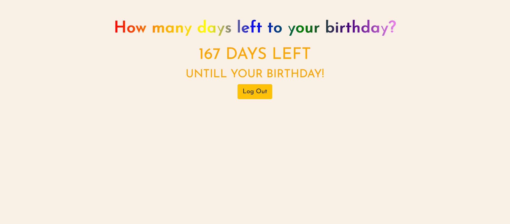
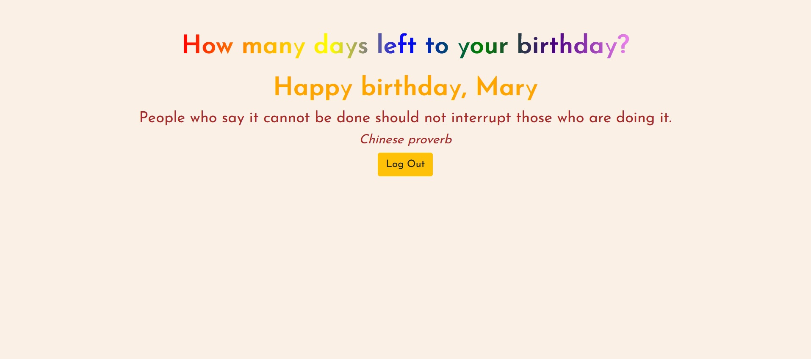

# Brithday Calculator App

This project was bootstrapped with [Create React App](https://github.com/facebook/create-react-app).

## Introduction
This project is about a kind of birthday calculator. User can visit the web page to fill some information for signing up. Then log in to get how many days left to his/her birthday. If today is the birthday, there will be a "happy birthday" and quote shown. If today is not the birthday, there will be the number of days left to birthday shown. Have fun 😁 

The project is created by two different ways. One branch is created using react class. Other branch is created using react hooks. The logic and functionaliy is the same.
### Scripts
In the project directory, you can run:

#### `npm start`

Runs the app in the development mode.\
Open [http://localhost:3000](http://localhost:3000) to view it in your browser.

The page will reload when you make changes.\
You may also see any lint errors in the console.

#### `npm run build`

Builds the app for production to the `build` folder.\
It correctly bundles React in production mode and optimizes the build for the best performance.

The build is minified and the filenames include the hashes.\
Your app is ready to be deployed!

See the section about [deployment](https://facebook.github.io/create-react-app/docs/deployment) for more information.

### Learn More

You can learn more in the [Create React App documentation](https://facebook.github.io/create-react-app/docs/getting-started).

To learn React, check out the [React documentation](https://reactjs.org/).

## Technology
- React Class
- React Hooks
- React Router
- JSX
- Html/Css
- Bootstrap
- Javscript
- Firebase
- API
- Async

## Features
This app allows users to:
- Sing up by filling the infromation of name, email, birthday, password
- login using email and password, then get the days left to birthday.

## Link to Published Project
[Birthday Calculator App](https://aurorarw.github.io/BirthdayCalculate/)

## Contact
Created by Aurora. Feel free to contact me via aurorawangca@gmail.com